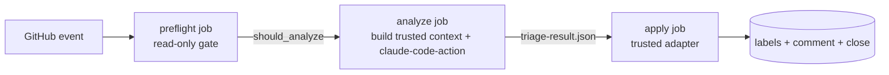

# Native Triage

This repo runs an ordinary GitHub Actions workflow (`.github/workflows/triage.yml`)
that drives the native Matt Pocock `triage` skill (`/mattpocock-skills:engineering/triage`).
Claude triages **read-only** and returns a structured JSON result; a small,
trusted adapter is the only writer. It applies exactly three things to the
target: one category label, one state label, and (for `wontfix`) a close. It
never edits code, assigns, dispatches, merges, or writes repository files.

## Data flow



1. **preflight** — deterministic, read-only. Decides `should_run`,
   `should_analyze` (fresh triage) vs `should_reconcile` (replay of an existing
   trusted marker). Skips bots, ordinary comments, unauthorized `/triage`,
   and ineligible PRs. Nothing is written.
2. **analyze** — checks out the trusted default branch, builds fixed
   `triage-context.json` + `triage-diff.patch` under `$RUNNER_TEMP` from the
   GitHub API (bounded, never executed), then runs the native triage skill
   read-only with a restricted tool surface and a strict JSON schema.
3. **apply** — the trusted adapter re-reads GitHub, validates the result,
   rejects stale heads / label conflicts / malformed output with zero writes,
   and reconciles labels + comment + `wontfix` close idempotently.

## Restriction surface

- The analysis token is **read-only** (`contents/issues/pull-requests: read`);
  the Claude run exposes only `Read,Glob,Grep,Skill` and denies all MCP tools.
  No Bash, Edit, Write, Task, checkout-of-fork-code, or artifact execution.
- The **apply** job is the only writer and holds `issues: write` only.
- Runs are serialized per target with `cancel-in-progress: false` so a retry
  repairs a partial prior run instead of duplicating.

## Plugin catalog

`.claude-plugin/marketplace.json` pins the `mattpocock-skills` plugin to
version `1.2.3` @ commit `6acc160e4e0cd062dbbbd7a1b26ae92855edf07e`. The analyze
job fails closed if that pin changes.

## Structured result

Model output is exactly four fields (`additionalProperties: false`):

```json
{"category": "bug|enhancement", "state": "<one of five>", "reason": "...", "comment": "..."}
```

Every comment must begin with `> *This was generated by AI during triage.*`;
`needs-info` needs concrete questions, `ready-for-*` needs an `## Agent Brief`,
and `wontfix` needs a durable reason. The adapter rejects anything malformed
or unknown rather than inventing a fallback.

## Labels

Exactly one category label and one state label are managed (`docs/agents/triage-labels.md`).
Conflicting managed labels fail closed; unrelated labels are preserved. The
five states are `needs-triage`, `needs-info`, `ready-for-agent`,
`ready-for-human`, `wontfix`.

## PR handling

`pull_request_target` + an external-author allowlist (`CONTRIBUTOR`,
`FIRST_TIME_CONTRIBUTOR`, `NONE`) — see `docs/agents/issue-tracker.md`. A PR
verdict is bound to its observed head SHA; a head change before the write makes
it stale and causes zero writes. If the bounded diff is truncated/unavailable,
the adapter only accepts `needs-info` or `ready-for-human` and rejects the
other three states.

## Identity & idempotency

Event keys bind each run:

- `issue:<n>:opened:<created_at>` / `issue:<n>:reopened:<updated_at>`
- `comment:<id>:created`
- `pr:<n>:(opened|reopened|synchronize):<head_sha>`

The adapter embeds a hidden marker (event key, target, head SHA, category,
state) in its comment, trusted only when authored by the writer bot. A marker
matching the event key makes a replayed run a no-op; the bot can still repair a
partial prior run by reconciling each operation independently.

## Configuration

| Variable | Purpose |
|---|---|
| `vars.ANTHROPIC_BASE_URL` | model gateway endpoint |
| `secrets.ANTHROPIC_API_KEY` | model credentials |
| `vars.TRIAGE_WRITER_BOT_ID` | numeric ID of the writer bot (marker trust) |

## Manual re-analysis

Comment `/triage` on an Issue (write authority) or an eligible external PR.

## Local scripts

- `scripts/triage_preflight.py` — read-only preflight gate (`$GITHUB_OUTPUT`).
- `scripts/triage_context.py` — builds `triage-context.json` + `triage-diff.patch`.
- `scripts/triage_adapter.py` — the only writer; validates and applies.
- `schema/triage-output.schema.json` — the model result contract.

Test coverage of the adapter lives in `tests/test_triage_adapter.py` and the
workflow's fail-closed contract in `tests/test_triage_workflow_contract.py`.