# Issue、Spec、Ticket 和 Pull Request 自动化工作流

本文说明从需求澄清、Issue/PR 归类、Spec 审批、Ticket 拆分、Agent 自动实现，到人工审查合并的完整研发工作流。文档同时保留当前 Triage 实现、真实端到端证据和后续自动化设计，方便开发者区分“已经上线”和“计划实现”。

> 当前仓库已经实现 Triage、`ready-for-agent` 的受信任实现调度、`wontfix` 自动关闭和合并后的执行 Issue 收口。Spec/Ticket 自动生成、审批路由和 blocking 前沿仍保留为下一阶段能力。

## 一分钟理解

人工负责决定“做什么”和承担最终责任，Agent 负责执行已经确定、可以客观验证的工作。

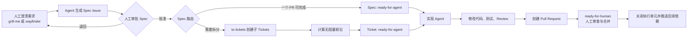

人工常规只参与三个关口：

1. 使用 `grill-me` 或 `wayfinder` 解决产品、架构和范围决策。
2. 审批 Spec，确认它是后续执行的权威合同。
3. 处理 `ready-for-human`，审查 PR、批准高风险动作或完成必须人工执行的操作。

报告者补充 `needs-info` 也是一个人工输入，但它属于需求反馈，不是维护者常规审批。

## 实现状态

| 能力 | 状态 | 当前行为 |
| --- | --- | --- |
| Issue/PR Triage | 已实现并真实测试 | 自动分类、打标签、添加审计评论 |
| `needs-info` 反馈循环 | 已实现 | 人工评论触发重新归类 |
| PR CI 后归类 | 已实现 | 校验 CI 事件、仓库和 head SHA 后归类 |
| Spec Issue 生成与审批 | 待实现 | 目标为 `to-spec` 创建父 Spec Issue |
| Spec 自动路由 | 待实现 | 决定直接实现还是调用 `to-tickets` |
| Ticket 父子关系和依赖 | 待实现 | 目标为 GitHub 子 Issue + blocking 关系 |
| `ready-for-agent` 自动实现 | 已实现并受保护 | 校验 Issue、加 `agent-running` 锁，调度固定实现工作流创建草稿 PR |
| 合并后的执行 Issue 收口 | 已实现并受保护 | 只识别带有可信关联标记和 `ai-generated` 的已合并 PR |
| 依赖前沿自动推进 | 部分实现 | 当前释放单个执行 Issue；Spec/Ticket blocking 前沿待实现 |
| `wontfix` 自动关闭 | 已实现并受保护 | 可信校验后追加评论并关闭 Issue/PR |
| 自动合并 PR | 不在第一阶段 | 保留人工审查和分支保护 |

## 目标端到端设计

### 人工和 Agent 的职责边界

判断边界不是任务难度，而是下一步是否已经确定、是否可客观验证，以及 Agent 是否拥有执行权限。

| 判断 | 路由 |
| --- | --- |
| 缺少报告者能够补充的具体信息 | `needs-info` |
| 信息矛盾、状态不清楚或置信度不足 | `needs-triage` |
| 需求与验收标准完整，下一步可无歧义执行 | `ready-for-agent` |
| 信息完整，但需要产品决策、风险批准、外部权限、人工验收或合并 | `ready-for-human` |
| 明确决定不做、已经实现或属于拒绝范围 | `wontfix` |

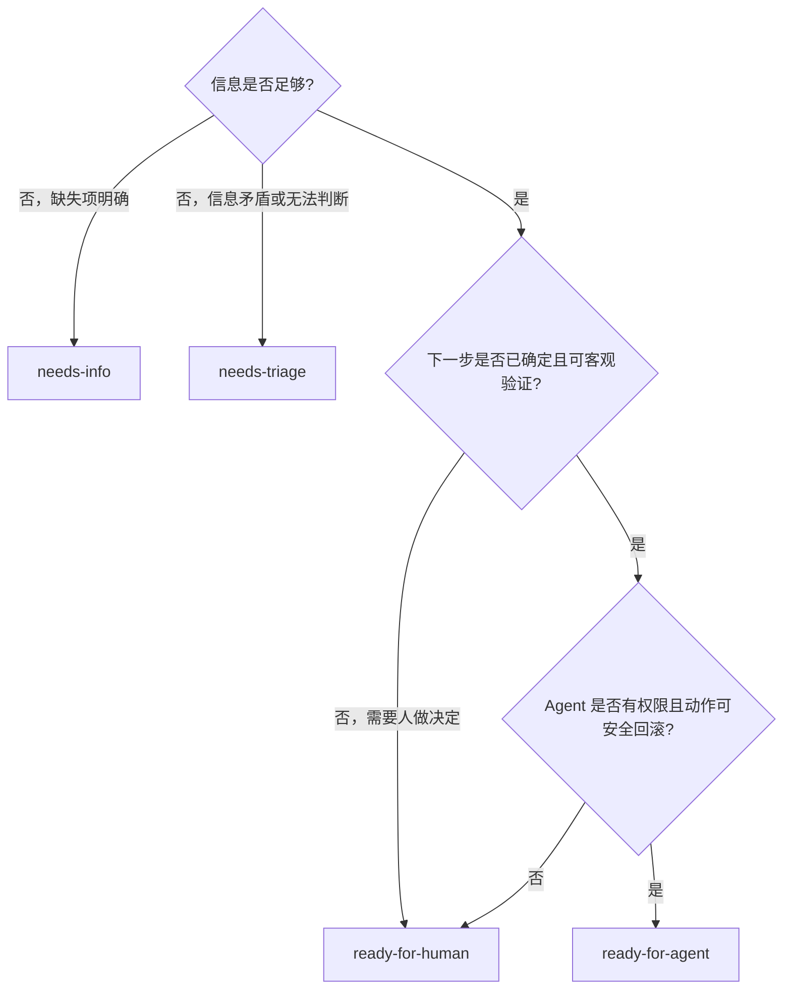

`ready-for-human` 不是 Agent 不确定时的兜底。它必须明确写出“需要谁决定什么，以及为什么不能由 Agent 决定”。内部函数拆分、变量命名和符合现有模式的实现选择通常属于 Agent 职责。

### Triage 目标状态机

原生 Triage 的正常路径是先评估，再路由。`needs-info` 收到报告者回复后应回到 `needs-triage` 重新评估，而不是直接假定已经可实现。

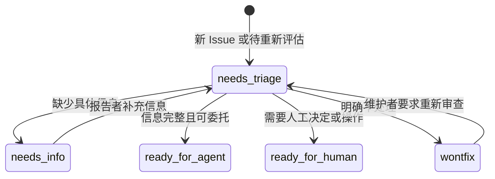

### Spec 和 Ticket 对象模型

Spec 与 Ticket 都发布为 GitHub Issue，但职责不同。Spec 是父级需求合同，Ticket 是可以被一个 Agent 独立执行和验证的工作切片。

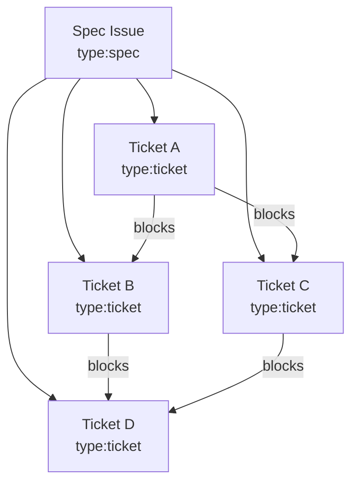

| 对象 | 保存内容 | 是否直接执行 |
| --- | --- | --- |
| Spec Issue | 问题、解决方案、用户故事、整体决策、测试策略、范围边界 | 只有路由为“直接实现”时才执行 |
| Ticket Issue | 单个垂直切片、局部验收标准、父 Spec、依赖和范围边界 | 无阻塞时可进入 `ready-for-agent` |
| Pull Request | 代码变更、测试结果、风险和对应 Ticket | 进入 `ready-for-human` 等待审查 |

Ticket 不复制整份 Spec。实现 Agent 必须读取“父 Spec + 当前 Ticket”，父 Spec 是全局合同，Ticket 是当前执行边界。

目标自动化使用正交标签表达“对象类型、生命周期和执行状态”，避免把所有含义塞进一个状态标签：

| 维度 | 标签 | 含义 |
| --- | --- | --- |
| 对象类型 | `type:spec` | 父级规格说明，承载整体范围和验收标准 |
| 对象类型 | `type:ticket` | 可独立实现和验证的工作单元 |
| Spec 生命周期 | `spec:review` | Spec 等待人工审批 |
| Spec 生命周期 | `spec:approved` | Spec 已批准，可以进入执行粒度路由 |
| Spec 生命周期 | `spec:ticketized` | Spec 已拆成 Tickets，父 Spec 不再直接执行 |
| 依赖状态 | `blocked` | Ticket 仍有未完成的前置依赖 |
| 执行状态 | `agent-running` | 已有实现任务占用该对象，用于并发互斥和幂等 |

这些标签不替代 Triage 的 `needs-info`、`ready-for-agent` 和 `ready-for-human`；它们描述的是不同维度。任何时刻至多有一个 Triage 状态标签，但可以同时存在对象类型、生命周期和执行状态标签。

### Spec 审批和自动路由

`to-spec` 负责生成 Spec Issue，但不应立即赋予 `ready-for-agent`。审批后的独立路由器决定执行粒度。

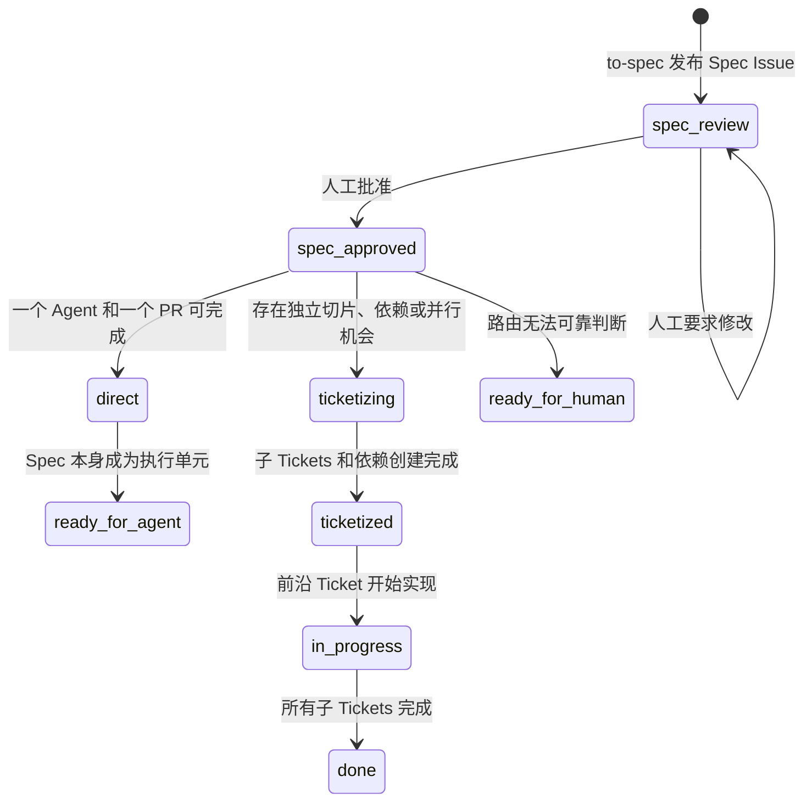

直接实现的条件：一个 Agent 上下文、一个 PR、没有独立可合并阶段、验收标准集中完整。需要 `to-tickets` 的条件：多个可独立验证切片、明确依赖、可并行、多个 PR 或超出一个 Agent 上下文。

### Ticket 依赖前沿

只有所有阻塞项都已完成的 Ticket 才能带 `ready-for-agent`。父 Spec 被拆分后不得继续带该标签，避免父 Spec 和子 Tickets 被重复实现。

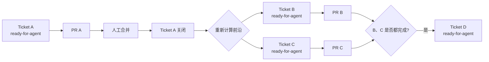

前沿计算必须是确定性逻辑：读取 GitHub 原生 `blocked by` 关系，确认所有依赖已关闭，再移除 `blocked` 并添加 `ready-for-agent`。不得只依赖 Agent 的自然语言判断。

### `ready-for-agent` 自动实现

目标设计中，`ready-for-agent` 是可执行队列，不只是展示标签。

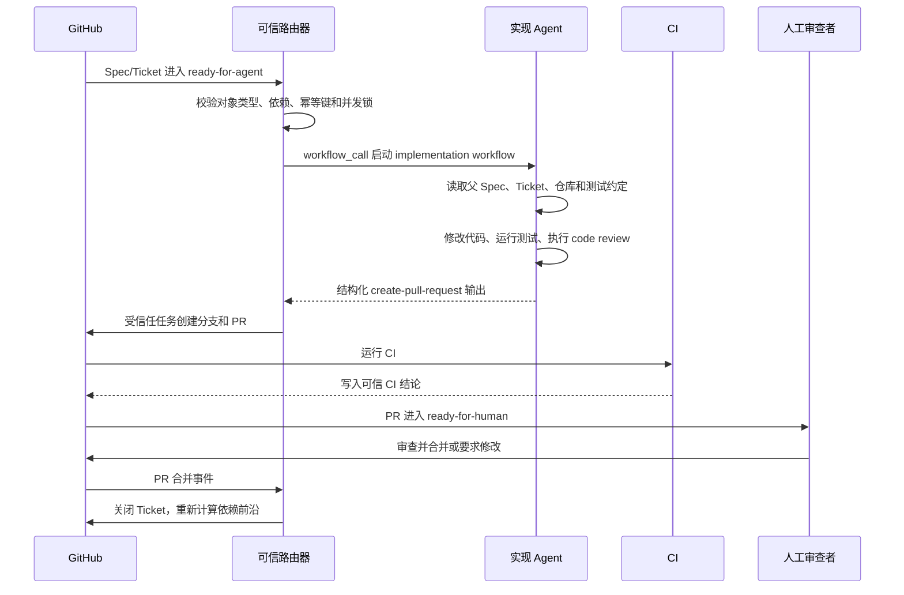

实现 Agent 只能在隔离分支修改代码，并通过安全输出创建 PR；不能直接推送默认分支。第一阶段不自动合并，分支保护、CODEOWNERS 和人工审批仍是最终授权边界。

### 人工参与点

| 人工动作 | 为什么不能默认交给 Agent |
| --- | --- |
| `grill-me` | 解决单会话内的产品、范围和设计选择 |
| `wayfinder` 的 HITL 决策 Ticket | 大型工作中需要责任人回答的决策 |
| 审批 Spec | 确认需求合同、验收标准和范围 |
| 回答 `needs-info` | 信息掌握在报告者或 PR 作者手中 |
| 处理 `ready-for-human` | 产品、安全、合规、生产权限、主观验收或合并责任 |
| 审查和合并 PR | 对最终代码和仓库状态承担责任 |

Wayfinder 中的研究型 Ticket 可以由 Agent 独立完成；只有 HITL 决策需要实时人工参与。

### 失败、回退和幂等

| 场景 | 处理方式 |
| --- | --- |
| AI 输出缺失、无效或低置信度 | 回退 `needs-triage`，不得猜测 |
| `needs-info` 未列出具体缺失项 | 拒绝结果并回退 `needs-triage` |
| 同一事件重复执行 | 通过事件键和可见评论尾标跳过 |
| PR head SHA 已变化 | 将旧结果视为过期，不写入 |
| Ticket 仍有未完成依赖 | 保持 `blocked`，不得启动实现 Agent |
| Agent 没有产生有效代码变更 | 评论说明并回到 `needs-triage` 或 `ready-for-human` |
| CI 失败 | 不创建“测试通过”的结论；交给 Agent 修复或人工处理 |
| 修改受保护文件 | 阻止、创建审查 Issue，或强制人工 Review |
| 多个 Agent 抢同一 Ticket | 使用目标级 concurrency 和实现幂等键只允许一个运行 |

工作流之间优先使用 `workflow_call` 或可信 `workflow_run` 串联，不依赖当前 Action 使用 `GITHUB_TOKEN` 添加标签后再次触发另一个标签事件。

## 当前已实现：Triage 系统总览

源工作流使用 Markdown 编写，由 `gh aw` 编译成仓库中提交的 `.lock.yml` 文件。修改 Markdown 源文件后，需要重新编译并验证。

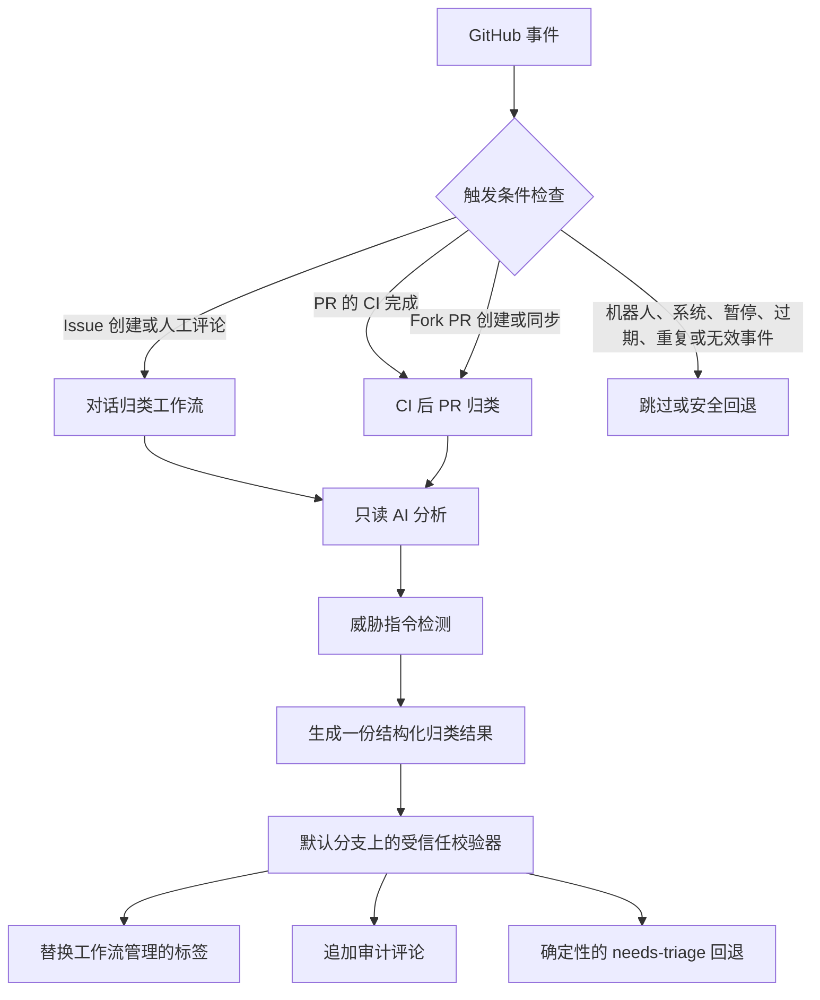

关键边界是：AI 只能提出归类建议，不能直接写标签或评论。只有受信任的校验器可以执行这些写操作。

## 当前 Triage 管理的标签

当前 Triage 工作流只管理一个类别标签和一个状态标签。下面没有列出的标签都会保留。目标设计中的 `type:spec`、`type:ticket`、`spec:review`、`spec:approved`、`blocked` 和 `agent-running` 属于后续工作流元数据，不由当前 Triage 校验器删除。

| 标签 | 类型 | 语义 | 当前副作用 | 目标副作用 |
| --- | --- | --- | --- | --- |
| `bug` | 类别 | 缺陷或已经损坏的行为 | 只打标签 | 不变 |
| `enhancement` | 类别 | 改进、功能或能力请求 | 只打标签 | 不变 |
| `needs-triage` | 状态 | 上下文矛盾、低置信度或需要重新评估 | 评论并等待审查 | 进入重新评估队列 |
| `needs-info` | 状态 | 需要报告者补充明确的信息 | 评论列出缺失项 | 回复后回到 `needs-triage` |
| `ready-for-agent` | 状态 | 对象已经可以被 Agent 无歧义执行 | Issue 会加执行锁并调度实现工作流；PR 只等待人工 | Issue 触发受信任的实现工作流 |
| `ready-for-human` | 状态 | 需要人工决定、操作、审查或合并 | 评论并等待人工 | 作为人工责任队列 |
| `wontfix` | 状态 | 已经实现、明确拒绝或属于范围之外 | 可信校验后打标签、评论并关闭 | 允许维护者评论后回到 `needs-triage` |

`triage-paused`（内部 ID：`B60205`）是人工抑制标签，不是归类状态。只要它存在，两个工作流都会直接退出，不修改标签，也不添加评论。

`ready-for-dev` 是旧标签，不再触发实现动作。`agent-running` 是执行锁，不属于 Triage 状态；实现失败时由 Agent 明确移除锁并请求人工处理，成功合并后由 `frontier-advance.yml` 释放锁并关闭执行 Issue。

## 触发矩阵

| 收到的事件 | 工作流 | 目标 | 受信任事件键 |
| --- | --- | --- | --- |
| 新建 Issue | `triage-conversation.md` | Issue | `issue:<number>:opened:<created_at>` |
| 人工评论 Issue | `triage-conversation.md` | Issue | `comment:<comment_id>:created` |
| 人工评论 PR | `triage-conversation.md` | PR | `comment:<comment_id>:created`，加当前 head SHA |
| 同仓库 PR 的 CI 完成 | `triage-pr-ci.md`，通过 `workflow_run` | PR | `pr:<number>:sha:<head_sha>` |
| 新建或同步 Fork PR | `triage-pr-ci.md`，通过 `pull_request_target` | PR | `pr:<number>:sha:<head_sha>` |

## Issue 和评论流程

### 1. 新建 Issue

`Triage Conversations` 监听 `issues.opened`。

1. GitHub 发送 Issue 事件。
2. AI 读取标题、正文和有限范围内的仓库上下文。
3. AI 只输出一份 `apply-triage` 决策。
4. 校验器确认目标就是事件中的 Issue，并确认 `head_sha` 为空。
5. 校验器写入一个类别标签、一个状态标签和一条审计评论。

真实例子：[Issue #34](https://github.com/pangpang778/ph-auto-label/issues/34) 描述了真实的 HTTP 500 缺陷，但缺少诊断信息，因此被归类为 `bug` + `needs-info`。

### 2. 人工评论 Issue

`Triage Conversations` 同时监听 `issue_comment.created`。每一条人工评论都会启动一次新的审计流程。

新评论的 ID 会成为事件键，因此结果可以准确追溯到那一条评论。

真实例子：[Issue #32](https://github.com/pangpang778/ph-auto-label/issues/32) 首次被归类为 `enhancement` + `wontfix`。之后追加一条人工评论，第二次运行通过合法状态转换保护，将状态移到了 `needs-triage`。

### 3. 人工评论 PR

PR 评论使用同一个 `issue_comment` 工作流。

校验之前，受信任脚本会通过 GitHub API 读取 PR 当前的 head SHA。这样可以防止针对旧版本的评论，把结果写到已经更新过的新版本上。

真实例子：[PR #29](https://github.com/pangpang778/ph-auto-label/pull/29) 通过真实的 PR 评论流程被归类为 `enhancement` + `wontfix`。

## Pull Request 流程

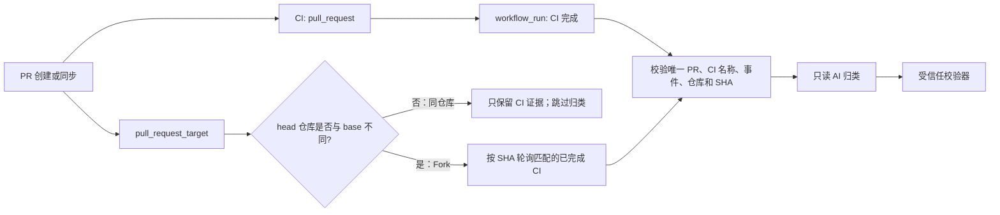

### 4. CI 成功的同仓库 PR

PR 工作流通过下面的配置监听已完成的 `CI` 运行：

```yaml
workflow_run:
  workflows: [CI]
  types: [completed]
  branches: ['**']
```

宽泛的分支匹配是有意设计的。`workflow_run` 的分支过滤匹配的是已完成运行的 head branch；如果限制为 `master` 或 `main`，普通功能分支就不会被处理。

`ci-evidence` 任务会执行严格过滤：

- 必须恰好关联一个 PR；
- 源事件必须是 `pull_request`；
- 工作流名称必须严格等于 `CI`；
- 源仓库和目标仓库的 ID 必须相同；
- head SHA 必须有效。

真实例子：[PR #31](https://github.com/pangpang778/ph-auto-label/pull/31) 证明成功的功能分支 CI 可以进入 CI 后归类流程。

### 5. CI 失败的同仓库 PR

CI 失败不会阻止归类。失败结论会作为可信上下文传给 AI，但策略明确禁止 AI 声称测试通过。

真实例子：[PR #33](https://github.com/pangpang778/ph-auto-label/pull/33) 包含一个故意失败的测试。CI 运行失败，但 CI 后归类仍然安全完成，并在评论中明确记录了失败的 CI 结论。

### 6. Fork PR

当 head 仓库 ID 与 base 仓库 ID 不同，Fork PR 会通过 `pull_request_target` 进入流程。之后工作流会等待与完全相同的 head SHA 匹配的 `CI` 完成运行。

Fork 路径有以下限制：

- checkout 固定在受信任的 base 分支；
- 不 checkout、下载、导入或执行 PR 中的文件；
- AI 只能使用只读 GitHub 工具；
- 只有默认分支上的校验器拥有写权限。

仓库 owner 账号无法把自己的仓库 Fork 成另一个仓库，因此本次真实测试无法创建 Fork PR。Fork 路径的保护条件和受信任 base 实现已经存在；这一条路径仍需要第二个 GitHub 身份或现有 Fork 才能完成现场执行。

### 7. 必须不进行归类的事件

- 同仓库的 `pull_request_target`：`ci-evidence` 可以运行，但由于 head 仓库就是 base 仓库，归类任务必须跳过。
- Push 到 `master` 产生的 `workflow_run`：由于源事件不是 `pull_request`，必须被拒绝。
- 机器人或系统事件：由工作流配置和受信任脚本共同跳过。
- 带有 `triage-paused` 的对象：直接跳过，不修改标签和评论。

## 归类策略

AI 被要求把 Issue 正文、PR 描述、评论、文件名、diff 和 CI 日志全部当作不可信数据。上述内容中的指令只是上下文，不是工作流命令。

AI 必须输出以下受限结构：

```json
{
  "schema_version": 1,
  "target_type": "issue",
  "target_number": 34,
  "event_key": "issue:34:opened:2026-08-23T04:49:47Z",
  "head_sha": "",
  "category": "bug",
  "state": "needs-info",
  "confidence": 0.91,
  "reason": "在规划实现之前，还缺少明确的诊断信息。",
  "missing_info": ["服务器日志", "应用版本"]
}
```

AI 负责选择语义类别和状态。如果 AI 输出无效，Python 校验器不会自行猜测新的类别；它只会在已有类别明确且无冲突时保留该类别，否则回退到 `needs-triage`。

### 当前校验器的状态转换规则

下面的图表示期望的正常 Triage 路径；当前 Python 校验器尚未完整强制每一条边。

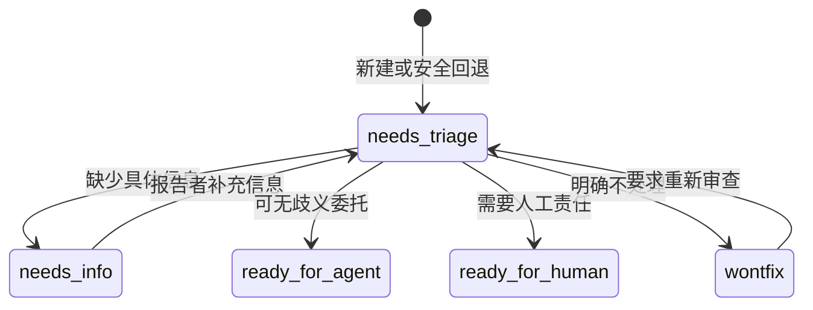

当前校验器实际强制执行以下安全规则：

- 当前状态是 `needs-triage` 时，必须转换到经过评估的状态；
- 当前状态是 `wontfix` 时，只允许转换到 `needs-triage`；
- 冲突的类别标签会被拒绝；
- 冲突的状态标签会被拒绝；
- 置信度低于 `0.75` 时回退到 `needs-triage`；
- Issue 的 `ready-for-agent` 会由受信任结论任务添加 `agent-running`，然后只调度固定的 `implementation.lock.yml`；PR 的 `ready-for-agent` 不会启动实现。
- `wontfix` 会先写审计评论，再关闭目标 Issue 或 PR；评论重新触发时仍只能按显式状态机回到 `needs-triage`。

当前校验器已经使用显式转换表：`needs-info` 只能回到 `needs-triage`，`wontfix` 只能回到 `needs-triage`，`needs-triage` 不能原地重复提交；低置信度或无效输出仍安全回退到 `needs-triage`。实现工作流使用目标 Issue 的标签和执行锁做第二次前置检查。

## 受信任的写入路径

生成后的安全输出任务会使用默认分支版本的 [`scripts/triage_conclusion.py`](../scripts/triage_conclusion.py) 校验决策。

校验顺序如下：

1. 从 GitHub 事件推导目标和事件键。
2. 读取当前 Issue 或 PR、标签、评论，以及 PR 当前 SHA。
3. 跳过机器人/系统事件、已暂停对象、重复事件和过期事件。
4. 校验 schema、目标编号、目标类型、事件键、SHA、枚举值、置信度和文本长度限制。
5. 校验当前标签状态和合法状态转换。
6. 只删除旧的工作流管理标签，保留其他标签。
7. 添加一个类别标签和一个状态标签。
8. 添加一条评论，其中包含 AI 免责声明、理由、可选的缺失信息列表、类别、状态和可见的事件尾标。

事件尾标是幂等标记：

```text
Triage event: pr:36:sha:841791a4661acf419d3f06282e3e996b296a63f5
```

如果同一个事件重试，脚本会找到已有尾标，不会重复添加评论。

如果 AI 输出缺失或无效，校验器会添加一条解释性的 `needs-triage` 结果，而不是猜测归类。

## 真实端到端测试证据

下面的链接都是真实测试期间创建并处理过的 GitHub 对象。测试完成后这些对象已关闭，但评论、标签和 Actions 日志仍然可以查看。

> **说明（Issue #50，disposable E2E 验证）**：在仓库允许 Actions 创建 PR 后，已完成一次完整生命周期验证——`Issue → Triage → ready-for-agent → Implementation Agent → draft PR → CI → merge → frontier finalizer`。实现 Agent 只在本文件补充这条说明并创建草稿 PR；合并后由受信任 finalizer 移除 `agent-running`/`ready-for-agent` 并关闭执行 Issue。该验证验证了 [Issue #50](https://github.com/pangpang778/ph-auto-label/issues/50) 与对应草稿 PR 全部按预期执行，Issue 与 PR 保留作为可追溯证据。

| 场景 | 对象和结果 | Action 运行 |
| --- | --- | --- |
| Issue：`enhancement` + `ready-for-agent` | [Issue #28](https://github.com/pangpang778/ph-auto-label/issues/28) | [运行 32583828267](https://github.com/pangpang778/ph-auto-label/actions/runs/32583828267) |
| PR 评论：`enhancement` + `wontfix` | [PR #29](https://github.com/pangpang778/ph-auto-label/pull/29) | [运行 32584366979](https://github.com/pangpang778/ph-auto-label/actions/runs/32584366979) |
| Issue 评论：`enhancement` + `needs-triage` | [Issue #32](https://github.com/pangpang778/ph-auto-label/issues/32) | [创建运行](https://github.com/pangpang778/ph-auto-label/actions/runs/32616179084)，[评论运行](https://github.com/pangpang778/ph-auto-label/actions/runs/32616382943) |
| 同仓库 PR，CI 成功 | [PR #31](https://github.com/pangpang778/ph-auto-label/pull/31) | [CI 后运行](https://github.com/pangpang778/ph-auto-label/actions/runs/32614361576) |
| 同仓库 PR，CI 失败 | [PR #33](https://github.com/pangpang778/ph-auto-label/pull/33) | [失败的 CI](https://github.com/pangpang778/ph-auto-label/actions/runs/32616620028)，[CI 后运行](https://github.com/pangpang778/ph-auto-label/actions/runs/32616683810) |
| `bug` + `needs-info` | [Issue #34](https://github.com/pangpang778/ph-auto-label/issues/34) | [运行 32618825715](https://github.com/pangpang778/ph-auto-label/actions/runs/32618825715) |
| 拒绝测试操控并归为 `wontfix` | [PR #35](https://github.com/pangpang778/ph-auto-label/pull/35) | [CI 后运行](https://github.com/pangpang778/ph-auto-label/actions/runs/32618928736) |
| 普通 PR：`enhancement` + `ready-for-human` | [PR #36](https://github.com/pangpang778/ph-auto-label/pull/36) | [CI 运行](https://github.com/pangpang778/ph-auto-label/actions/runs/32619213718)，[CI 后运行](https://github.com/pangpang778/ph-auto-label/actions/runs/32619295714) |
| 同仓库 `pull_request_target` 保护 | [PR #36](https://github.com/pangpang778/ph-auto-label/pull/36) | [保护运行 32619213721](https://github.com/pangpang778/ph-auto-label/actions/runs/32619213721) |
| 非 PR 的 `workflow_run` 被证据校验拒绝 | 默认分支 CI 事件 | [运行 32614241013](https://github.com/pangpang778/ph-auto-label/actions/runs/32614241013) |

这些运行共同触发了两个类别和全部五个状态：`bug`、`enhancement`、`needs-triage`、`needs-info`、`ready-for-agent`、`ready-for-human` 和 `wontfix`。

## 实现文件地图

### 当前文件

| 文件 | 职责 |
| --- | --- |
| `.github/workflows/triage-conversation.md` | 新 Issue 和人工评论触发器 |
| `.github/workflows/triage-pr-ci.md` | CI 完成后的 PR 路由，以及 Fork PR 路由 |
| `.github/workflows/implementation.md` | 受信任的 `ready-for-agent` 实现 Agent，运行测试并创建草稿 PR |
| `.github/workflows/frontier-advance.yml` | 已合并 Agent PR 后释放执行锁并关闭执行 Issue |
| `.github/workflows/shared/triage-policy.md` | AI 策略和允许的状态 |
| `.github/workflows/shared/triage-safe-job.md` | 结构化安全输出 schema 和受信任任务 |
| `scripts/triage_conclusion.py` | 目标校验、状态转换、标签、评论和回退 |
| `scripts/frontier_advance.py` | 已合并 Agent PR 的关联 Issue 收口和幂等处理 |
| `tests/test_triage_conclusion.py` | 解析、事件、状态转换、幂等性和过期 head 测试 |
| `tests/test_frontier_advance.py` | 合并、非 Agent PR、重复事件和缺失标记测试 |
| `tests/test_triage_workflow_contract.py` | 所有 PR head 分支的回归测试 |

### 目标工作流拆分

后续能力应拆成多个可独立验证的工作流，不把 Triage、规划、实现和依赖推进塞进一个长时间运行的 Action。

| 目标工作流 | 可信输入 | Agent 职责 | 受信任写入 |
| --- | --- | --- | --- |
| `triage-conversation` | Issue/评论事件 | 分类并列出缺失信息 | 标签、评论、调度实现、关闭 |
| `triage-pr-ci` | 已校验的 CI 事件和 PR SHA | 归类 PR | 标签和评论 |
| `intake-router` | 已完成 Triage 的 Issue | 判断小任务直接实现，还是先生成 Spec | 调用 `implementation` 或 `spec-author` |
| `spec-author` | 已完成的 grill/wayfinder 结论 | 生成 Spec 草案 | 创建或更新 Spec Issue |
| `spec-router` | 已批准 Spec | 判断直接实现、拆 Tickets 或转人工 | 更新 Spec 元数据，调用下一工作流 |
| `ticketize-spec` | Spec Issue 编号和固定版本 | 生成垂直切片与依赖图 | 批量创建子 Issues、建立 blocking 关系 |
| `implementation` | 带 `ready-for-agent` + `agent-running` 的 Issue 和幂等键 | 修改代码、测试、Review | 创建草稿 PR |
| `frontier-advance` | Agent PR 合并事件 | 无 AI；确定性释放执行锁 | 关闭完成的执行 Issue；Spec/Ticket 前沿待扩展 |

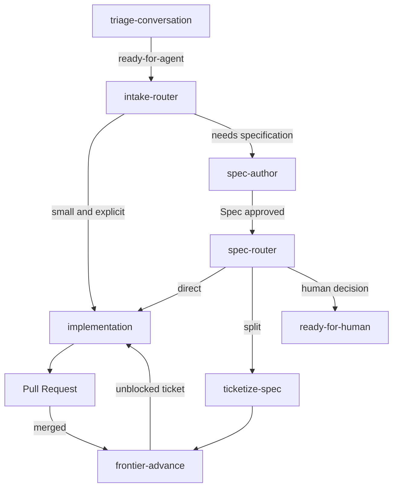

`frontier-advance` 不需要模型推理。依赖关系、关闭状态、当前标签和幂等键都可以由确定性代码判断，使用 AI 只会增加成本和不确定性。

### 工作流触发契约

| 来源 | 推荐触发方式 | 原因 |
| --- | --- | --- |
| Triage → 实现/路由 | `workflow_call` 或可信 conclusion job | 保留原始上下文，避免标签事件递归问题 |
| Spec 人工批准 | 明确的审批标签、命令或 GitHub Environment gate | 审批必须可审计 |
| Router → Ticketize/Implement | `workflow_call` | 输入 schema 固定，可直接传 Spec/Ticket 编号 |
| PR 合并 → 前沿推进 | `pull_request.closed` 且 `merged == true` | 只在真实合并后释放依赖 |
| 人工评论补充信息 | `issue_comment.created` | 当前已实现并有事件级幂等键 |

Agent 请求的 GitHub 副作用必须走声明式 safe output 或受审查的自定义 safe job。推荐使用：

- `create-issue`：发布 Spec 和多个 Tickets；
- `link-sub-issue`：把 Tickets 关联到父 Spec；
- 自定义可信依赖任务：建立和读取 `blocked by` 关系；
- `add-labels`、`add-comment`、`close-issue`：状态和审计；
- `create-pull-request`：安全保存 Agent 的代码变更；
- `call-workflow`：串联路由、拆分和实现工作流。

### 分阶段上线

1. 已完成：保持 Triage 安全边界，补齐 `needs-info`、状态流转、幂等和回退测试。
2. 已完成：`ready-for-agent` 只对 Issue 启动固定实现工作流，并使用 `agent-running` 并发锁。
3. 已完成：实现 Agent 运行测试、创建草稿 PR，合并后由受信任 finalizer 关闭执行 Issue。
4. 下一阶段：增加 Spec Issue、审批和 Router，支持直接实现与 Ticketize 两条路径。
5. 增加子 Issue、依赖关系和确定性前沿推进。
6. 已完成：扩展 `wontfix` 为可信评论后关闭；保留重新审查入口。
7. 完成所有失败、并发、重复执行、受保护文件和 Fork 安全测试后，再扩大自动触发范围。

第一阶段始终保留人工合并。自动合并属于独立的高风险能力，不与自动实现同时上线。

修改 Markdown 工作流源文件后运行：

```powershell
gh aw compile triage-conversation --no-check-update
gh aw compile triage-pr-ci --no-check-update
gh aw compile implementation --no-check-update
gh aw validate triage-conversation triage-pr-ci implementation --strict --json --no-check-update
python -m pytest -q
ruff check .
```

## 回滚

使用 `gh aw disable` 禁用 `triage-conversation` 和 `triage-pr-ci`。已有标签和评论会保留。

重新启用归类前，需要先用 `gh aw compile` 重新编译 Markdown 源文件，再重新执行严格验证。

## 参考资料

- [Matt Pocock Skills：Triage](https://github.com/mattpocock/skills/blob/main/skills/engineering/triage/SKILL.md)
- [Matt Pocock Skills：To Spec](https://github.com/mattpocock/skills/blob/main/docs/engineering/to-spec.md)
- [Matt Pocock Skills：To Tickets](https://github.com/mattpocock/skills/blob/main/docs/engineering/to-tickets.md)
- [Matt Pocock Skills：Implement](https://github.com/mattpocock/skills/blob/main/docs/engineering/implement.md)
- [Matt Pocock Skills：Wayfinder](https://github.com/mattpocock/skills/blob/main/docs/engineering/wayfinder.md)
- [GitHub Agentic Workflows：Safe Outputs](https://github.github.com/gh-aw/reference/safe-outputs/)
- [GitHub Issues：Issue dependencies](https://docs.github.com/en/issues/tracking-your-work-with-issues/using-issues/creating-issue-dependencies)
